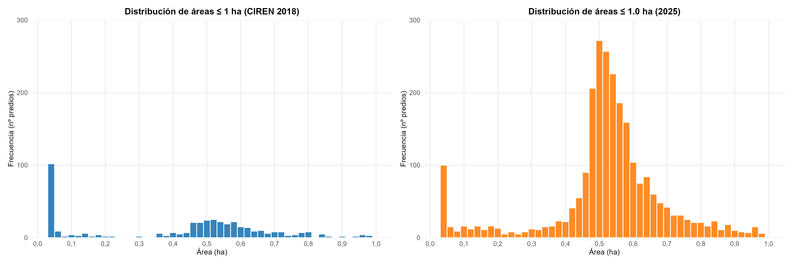

# Histograma de superficie predial

## Descripción

Este script permite generar un histograma de distribución de superficies prediales a partir de una capa vectorial.

El procedimiento calcula la superficie de cada polígono en hectáreas, filtra los predios según un rango definido por el usuario y genera un histograma que muestra la frecuencia de predios dentro de cada intervalo de superficie.

Este tipo de gráfico permite analizar la distribución de tamaños prediales y visualizar la concentración de predios dentro de determinados rangos de superficie.



---

## Materiales utilizados

### Software
* R
* RStudio

### Librerías
* `sf`: Lectura y procesamiento de datos espaciales.
* `dplyr`: Filtrado y manipulación de datos.
* `ggplot2`: Generación y personalización del histograma.

### Datos de entrada
El script requiere una capa vectorial con geometrías de tipo polígono. Se pueden utilizar formatos estándar como:

* Shapefile (`.shp`)
* GeoPackage (`.gpkg`)

El archivo debe contener la geometría de los predios a analizar.

---

## Uso del script

La capa de entrada se especifica mediante la variable `archivo`. El archivo puede encontrarse en la misma carpeta que el script o mediante su ruta completa:

```r
# Ejemplo con Shapefile
archivo <- "predios.shp"

# Ejemplo con GeoPackage
archivo <- "predios.gpkg"
```

---

## Parámetros del análisis

Los parámetros principales se configuran al inicio del script:

```r
rango_min <- 0.03
rango_max <- 1
ancho_bin <- 0.02
```

* `rango_min`: Superficie mínima considerada en hectáreas (por ejemplo, `0.03` considera predios desde 0,03 ha).
* `rango_max`: Superficie máxima considerada en hectáreas (por ejemplo, `1` considera predios hasta 1 ha).
* `ancho_bin`: Ancho de los intervalos (bins) del histograma en hectáreas (por ejemplo, `0.02` genera intervalos de 0,02 ha). Un valor menor genera mayor nivel de detalle; un valor mayor agrupa más los datos.

---

## Procesamiento de datos

### Cálculo de superficie
El script calcula automáticamente la superficie de cada polígono y la convierte a hectáreas:

```r
predios$ha <- as.numeric(st_area(predios)) / 10000
```

> **Nota:** La conversión utiliza `1 ha = 10.000 m²`. Es fundamental que la capa vectorial se encuentre en un sistema de coordenadas proyectado adecuado para el cálculo métrico de áreas (por ejemplo, UTM).

### Filtrado de datos
Posteriormente, el script filtra los predios según el rango establecido:

```r
predios_filtrados <- predios %>%
  filter(ha >= rango_min, ha <= rango_max)
```

---

## Personalización del gráfico

### Título y nombres de ejes
Los textos se configuran dentro de `labs()`:

```r
title = "Distribución de superficies prediales"
x     = "Área (ha)"
y     = "Frecuencia (nº predios)"
```

### Estética y colores
La apariencia de las barras se define en `geom_histogram()`:

```r
geom_histogram(
  binwidth = ancho_bin,
  fill     = "#1f77b4",
  color    = "white",
  alpha    = 0.9
)
```

* `fill`: Color de relleno de las barras.
* `color`: Color del borde de las barras.
* `alpha`: Nivel de opacidad (valores cercanos a 1 son más opacos).

### Tema visual
El gráfico utiliza `theme_minimal()`. Las modificaciones tipográficas y de márgenes adicionales se ajustan dentro de `theme()`.

---

## Exportación

El gráfico se exporta como imagen mediante `ggsave()`:

```r
archivo_salida <- "histograma_superficie_predial.png"

ggsave(
  filename = archivo_salida,
  plot     = grafico,
  width    = 10,
  height   = 5,
  dpi      = 300
)
```

* `width`: Ancho de la imagen.
* `height`: Alto de la imagen.
* `dpi`: Resolución de salida (se recomienda 300 dpi para informes o publicaciones).

---

## Interpretación del resultado

El archivo generado presenta las siguientes características:

* **Eje X:** Representa la superficie de los predios en hectáreas.
* **Eje Y:** Representa la frecuencia (número de predios).
* **Barras:** Cada barra representa un intervalo de superficie. Su altura indica la cantidad de polígonos dentro de ese rango.

### Sistema de coordenadas y proyección

Para que el cálculo de superficie en hectáreas sea correcto, la capa debe estar en un sistema de coordenadas proyectado (por ejemplo, UTM). Para transformar o reproyectar la capa en R, utiliza:

```r
# Transformar a un sistema proyectado (ejemplo: UTM Huso 19S / EPSG:32719)
predios <- st_transform(predios, crs = 32719)
```

Personalización cosmética del gráfico
La apariencia visual del histograma se configura mediante los parámetros de geom_histogram() y theme():

```r
geom_histogram(
  binwidth = ancho_bin,  # Ancho de los intervalos
  fill     = "#1f77b4",  # Color de relleno de las barras (código HEX o nombre)
  color    = "white",    # Color de las líneas de borde
  alpha    = 0.9         # Transparencia (0: transparente, 1: opaco)
)
```

Para modificar tipografías, fondos, cuadrículas y márgenes:

```r
theme_minimal()

# Ajustes cosméticos adicionales
theme(
  plot.title   = element_text(face = "bold", size = 14, hjust = 0.5),
  axis.title   = element_text(face = "bold", size = 11),
  axis.text    = element_text(size = 10),
  panel.grid.minor = element_blank()
)
```
