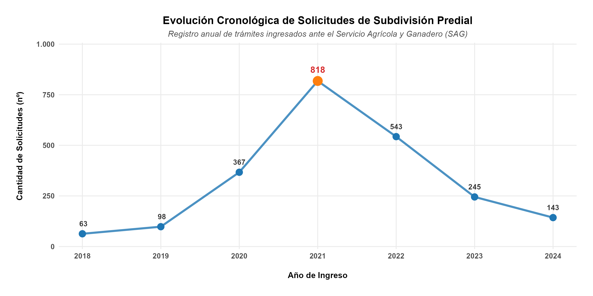

# Time Series Plot: SAG Applications

## Description

This script generates a time series line plot representing the annual evolution of applications registered with the Agriculture and Livestock Service (SAG - Servicio Agrícola y Ganadero).

The plot visualizes the variation of applications over time and automatically identifies the year with the highest number of records (the peak value of the series).



---

## Requirements

### Software
* R
* RStudio

### Libraries
* `readxl`: Reading Excel files.
* `dplyr`: Data manipulation and transformation.
* `ggplot2`: Plot generation and customization.

### Data
An Excel file named `SAG_solicitudes.xlsx` is used. The script is designed for a data layout where years are located in row 1 and total applications are in row 10.

| Range | Content |
| :--- | :--- |
| `B1:H1` | Years |
| `B10:H10` | Total applications |

---

## How to Use the Script

The Excel file must be placed in the same directory as the script, or the corresponding path must be specified in the variable:

```r
archivo_excel <- "SAG_solicitudes.xlsx"
```

### Configuring Data Ranges

If the years or values are located in different cells within the Excel sheet, adjust the ranges used in:

```r
# Define ranges
anios_horizontal <- read_excel(
  archivo_excel,
  range = "B1:H1",
  col_names = FALSE
)

totales_horizontal <- read_excel(
  archivo_excel,
  range = "B10:H10",
  col_names = FALSE
)
```

For example, if the years were in `C2:J2` and the values in `C11:J11`:

```r
range = "C2:J2"
range = "C11:J11"
```

---

## Customizing the Plot

### Labels and Titles

Main text elements can be modified directly within the label configuration:

```r
title    = "Chronological Evolution of Land Subdivision Applications"
subtitle = "Annual record of applications submitted to the Agriculture and Livestock Service (SAG)"
x        = "Year of Submission"
y        = "Number of Applications"
caption  = "Source: Own elaboration based on records from the Regional Directorate of the Agriculture and Livestock Service (SAG)."
```

### Aesthetics and Colors

* **Main line:** Adjust color, line width (`linewidth`), and transparency (`alpha`):
  ```r
  geom_line(
    color = "#1f77b4",
    linewidth = 1.2,
    alpha = 0.8
  )
  ```

* **Data points:** Modify the color and size of standard points and the peak value point:
  ```r
  # Standard points
  geom_point(
    color = "#1f77b4",
    size = 3.5
  )

  # Peak point
  geom_point(
    data = dato_peak,
    color = "#ff7f0e",
    size = 5
  )
  ```

### Value Labels

The size and styling of the numeric labels above points are controlled via:

```r
size = 3.2
fontface = "bold"
```

### Visual Theme

The plot uses `theme_minimal()`. Detailed configuration for titles, axes, text, and margins is defined inside `theme()`.

---

## Automatic Peak Identification

The script automatically identifies the year with the highest volume of applications using:

```r
dato_peak <- df_sag %>%
  filter(Solicitudes == max(Solicitudes))
```

There is no need to manually specify which year has the highest number of records. If the underlying data changes, the peak value will automatically update upon re-running the script.

---

## Plot Export

The output file name and its dimensions are configured using:

```r
archivo_salida <- "Grafico_SAG_Totales_Anuales.png"

ggsave(
  filename = archivo_salida,
  plot = p_sag_final,
  width = 10,
  height = 5,
  dpi = 300
)
```

* `width`: Image width.
* `height`: Image height.
* `dpi`: Image resolution (300 dpi is recommended for reports and academic publications).
